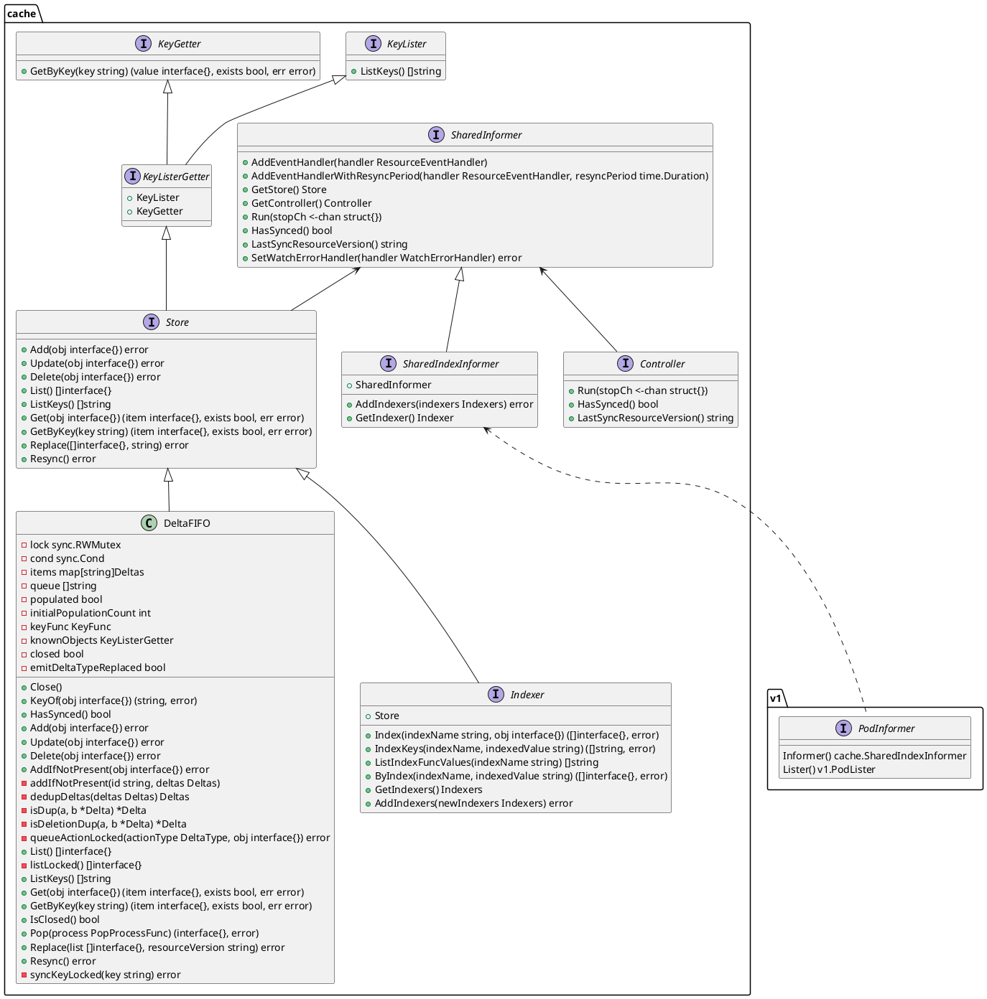

# Kubernetes Informer 机制详解

## Kubernetes为什么需要Informer

Kubernetes是以声明式API为基础的容器编排系统，声明式API定义了很多状态，使得集群可以从某个状态向期望的状态趋近（最终一致性）。

Kubernetes是一个典型的master-slave架构，slave需要同步master的状态，即Node节点需要通过向API Server发送REST请求同步存储在etcd中的状态。在大型生产环境中，可能存在成千上万的slave节点，所以需要一个高效的、可靠的数据同步机制，因此有了Informer。

## Informer概述

在 kubernetes 中, Client（比如Kubelet）和APIServer之间通过 informer 来做到了消息的**实时性、可靠性、顺序性**，同时**有效减轻了Kubernetes的负载**。

### Informer架构设计


Informer架构设计中有多个核心组件: 

1. **Reflector**: 使用`ListAndWatch()`同步指定类型的 Kubernetes 资源, List用于全量同步指定的资源，Watch用于监控资源的变化。比如 Added, Updated 和 Deleted 事件, 并将资源对象存放到本地缓存 DeltaFIFO; 
这里使用curl访问集群，使用下面的命令获取集群的APIserver地址和Token。
```bash
APISERVER=$(kubectl config view | grep server | cut -f 2- -d ":" | tr -d " ")
TOKEN=$(kubectl describe secret $(kubectl get secrets | grep default | cut -f1 -d ' ') | grep -E '^token' | cut -f2 -d':' | tr -d ' ')
```
List请求
```
$ curl -i $APISERVER/api/v1/namespaces/kube-system/pods --header "Authorization: Bearer $TOKEN" --insecure
  % Total    % Received % Xferd  Average Speed   Time    Time     Time  Current
                                 Dload  Upload   Total   Spent    Left  Speed
  0     0    0     0    0     0      0      0 --:--:-- --:--:-- --:--:--     0HTTP/2 200
cache-control: no-cache, private
content-type: application/json
date: Thu, 25 Mar 2021 08:39:27 GMT

{
  "kind": "PodList",
  "apiVersion": "v1",
  "metadata": {
    "selfLink": "/api/v1/namespaces/kube-system/pods",
    "resourceVersion": "481435"
  },
  "items": [
    {
      "metadata": {
        "name": "coredns-f9fd979d6-8nbnt",
        "generateName": "coredns-f9fd979d6-",
        "namespace": "kube-system",
        "selfLink": "/api/v1/namespaces/kube-system/pods/coredns-f9fd979d6-8nbnt",
        "uid": "7251cb17-4e06-41fb-911e-1c810856e934",
        "resourceVersion": "326159",
        "creationTimestamp": "2021-03-12T13:48:13Z",
        "labels": {
          "k8s-app": "kube-dns",
          "pod-template-hash": "f9fd979d6"
        },
        ...
    },
    ...
}
```
Watch请求
```watch
$ curl -i $APISERVER/api/v1/namespaces/kube-system/pods?watch=yes --header "Authorization: Bearer $TOKEN" --insecure
  % Total    % Received % Xferd  Average Speed   Time    Time     Time  Current
                                 Dload  Upload   Total   Spent    Left  Speed
  0     0    0     0    0     0      0      0 --:--:-- --:--:-- --:--:--     0HTTP/2 200
cache-control: no-cache, private
content-type: application/json
date: Fri, 26 Mar 2021 09:31:14 GMT

{"type":"ADDED", "object":{"kind":"Pod","apiVersion":"v1",...}}
{"type":"ADDED", "object":{"kind":"Pod","apiVersion":"v1",...}}
{"type":"MODIFIED", "object":{"kind":"Pod","apiVersion":"v1",...}}
```
Watch是通过HTTP 长连接接收API Server发送的资源变更事件，使用的Chunked transfer coding。
代码位置: k8s.io/apiserver/pkg/endpoints/handlers/watch.go，源码如下
```go
func (s *WatchServer) ServeHTTP(w http.ResponseWriter, req *http.Request) {
    ...
    // begin the stream
    w.Header().Set("Content-Type", s.MediaType)
    w.Header().Set("Transfer-Encoding", "chunked")
    w.WriteHeader(http.StatusOK)
    flusher.Flush()
    ...
}
```

2. **DeltaFIFO**: 拆开理解, FIFO 就是一个队列, 拥有队列基本方法(ADD, UPDATE, DELETE, LIST, POP, CLOSE 等), Delta 是一个资源对象存储, 存储对应的事件修改事件类型和资源对象; 当DeltaFIFO的POP()方法被调用时，会触发Controller注册的回调函数来处理对应类型的事件。
```go
type DeltaFIFO struct {
    ...
    // 维护了 key 和 Deltas 的映射关系，key 使用 MetaNamespaceKeyFunc 计算，
    // key 的形式为 namespace/name，比如：kube-system/coredns-f9fd979d6-8nbnt
    // 也就是说一个资源对象的修改，在 items 中永远只有一条记录，对同一资源的修改
    // 在对应 key 的 Deltas 切片中 append。
	items map[string]Deltas
    // queue 维护了资源对象入队的相对顺序，这里相对顺序是指资源对象的相对顺序，而不是 Delta 的顺序，
    // 可能存在一个 Delta 先进后出的情况。
	queue []string
    ...
}
```

```
        ┌──────────────────┐
Delta   |{"DeltaType", Obj}| 
        └──────────────────┘
DeltaType: Added, Updated, Deleted, Replaced, Sync

        ┌───────┐┌───────┐┌───────┐
queue   │ObjKey1││ObjKey2││ObjKey3│
        └───────┘└───────┘└───────┘

        ┌─────────────────────────────────────────────────────────────┐
itmes   │ObjKey1: [{"Added",Obj1} {"Updated",Obj1}]                   │
        ├─────────────────────────────────────────────────────────────┤
        │ObjKey2: [{"Added",Obj2},{"Deleted",Obj2},{"Sync",Obj2}]     │
        ├─────────────────────────────────────────────────────────────┤
        │ObjKey3: [{"Added",Obj3},{"Updated",Obj3},{"Deleted",Obj3}]  │
        └─────────────────────────────────────────────────────────────┘
```
3. **Indexer**: Client-go 用来存储资源对象并自带索引功能的本地存储, List和Watch到的资源都会存储在Indexer中, Indexer 与 Etcd 的数据具有最终一致性关系.从而 client-go 可以本地读取, 减少 Kubernetes API 和 Etcd 集群的压力.
   - ThreadSafeStore  ----  threadSafeMap  线程安全的KV存储
   - Indices  ---- 索引


## Demo

```go
/**
 * @author xiangqilin
 * @date 2020/12/8
**/
package main

import (
    "fmt"
    v1 "k8s.io/apimachinery/pkg/apis/meta/v1"
    "k8s.io/client-go/informers"
    "k8s.io/client-go/kubernetes"
    "k8s.io/client-go/tools/cache"
    "k8s.io/client-go/tools/clientcmd"
    "k8s.io/client-go/util/homedir"
    "log"
    "path"
)

func main() {
    homedir := homedir.HomeDir()
    configPath := path.Join(homedir, ".kube/config")
    fmt.Println(configPath)
    config, err := clientcmd.BuildConfigFromFlags("", configPath)
    if err != nil {
        panic(err)
    }

    // 创建 ClientSet 对象, Informer 需要通过 ClientSet 和 Kubernetes API server 通信
    clientSet, err := kubernetes.NewForConfig(config)
    if err != nil {
        panic(err)
    }

    // 创建 stopCh 对象，该对象用于在应用程序退出之前通知 Informer 退出
    stopCh := make(chan struct{})
    defer close(stopCh)

    // NewSharedInformerFactory(client kubernetes.Interface, defaultResync time.Duration) SharedInformerFactory
    // 实例化 sharedInformer 对象, 它接收两个参数:
    // 1. client: 用于和 Kubernetes API server通信
    // 2. defaultResync: 设置多久时间进行一次 Resync (重新同步), Resync会周期性执行List操作，
    //       将所有资源都存放在 Informer Store 中, 如果该参数为0, 则不同步.
    sharedInformers := informers.NewSharedInformerFactory(clientSet, time.Minute)

    // 得到具体资源对象的informer对象
    informer := sharedInformers.Core().V1().Pods().Informer()

    // 通过 informer.AddEventHandler函数为资源对象添加资源对象的回调方法，支持3种资源事件的回调方法:
    // 1. AddFunc: 当创建资源时触发的事件回调方法
    // 2. UpdateFunc: 当更新资源时触发的事件回调方法
    // 3. DeleteFunc: 当删除资源时触发的事件回调用法
    informer.AddEventHandler(cache.ResourceEventHandlerFuncs{
        // Kubernetes 使用 Informer机制时触发资源的回调方法，将资源对象推送到 WorkQueue 或其他队列，
        // 这里直接触发资源的事件。
        AddFunc: func(obj interface{}) {
            mObj := obj.(v1.Object)
            log.Printf("New Pod Added to Store: %s", mObj.GetName())
        },
        UpdateFunc: func(oldObj, newObj interface{}) {
            oObj := oldObj.(v1.Object)
            nObj := newObj.(v1.Object)
            log.Printf("%s with UID %s has been updated to %s with %s",
                nObj.GetName(), nObj.GetUID(), oObj.GetName(), oObj.GetUID())
        },
        DeleteFunc: func(obj interface{}) {
            dObje := obj.(v1.Object)
            log.Printf("Resource %s has been deleted.", dObje.GetName())
        },
    })

    // 运行 informer
    informer.Run(stopCh)
}
```

## 资源Informer和SharedInformer

### 资源Informer

每种资源都实现了Informer机制，Informer机制需要实现两个方法，一个是Informer()和Lister():

- Informer() ：用于获取对应的SharedInformer接口实现，比如SharedIndexInformer，以便实现对响应资源的监控。所有Kubernetes内置资源的Informer实现都放在了 k8s.io/client-go/informers 下。
- Lister() ：对应资源的访问接口，可以用Lister()来快速访问响应的资源。所有Kubernetes内置Lister()实现都放在了 k8s.io/client-go/informers/listers 下。

可以通过SharedInformerFactory调用XXXInformer.Informer()方法来创建指定的Group/Version,Kind=XXX的SharedIndexInformer对象。

```go
type PodInformer interface {
    Informer() cache.SharedIndexInformer
    Lister() v1.PodLister
}

type ServiceInformer interface {
    Informer() cache.SharedIndexInformer
    Lister() v1.ServiceLister
}
```

### SharedInformer

==SharedInformer提供了Informer共享机制，来降低API Server序列化的压力。==

> 场景：在一个Client中，有多个地方需要感知Kubernetes资源对象的变化，不同的开发者在一个client中可能对同一种资源进行多次实例化。

每次对Informer的实例化都会创建一个与之对应的Reflector，同一个资源在几乎相同的时间点会被多次Decode，这十分消耗CPU资源。

所以Kubernetes提出了SharedInformer(SharedIndexInformer只是多了Indexer)，一种资源在Client中最多只存在一个SharedInformer，可以认为是针对这种资源的“单例“。在Kubernetes中，通过反射类型和map实现同一种资源共享一个SharedInformer。

在上面的Demo中，我们通过以下代码来初始化了一个sharedInformerFactory对象：

```go
sharedInformers := informers.NewSharedInformerFactory(clientSet, time.Minute)
```
其中`informers.NewSharedInformerFactory(clientSet, time.Minute)`使用`NewSharedInformerFactoryWithOptions`在内部创建了一个sharedInformerFactory对象。
```go
func NewSharedInformerFactoryWithOptions(client kubernetes.Interface, defaultResync time.Duration, options ...SharedInformerOption) SharedInformerFactory {
    factory := &sharedInformerFactory{
        ...
        // 通过一个map，key为对应资源类型的反射类型 reflect.Type，值为SharedIndexInformer
        informers:        make(map[reflect.Type]cache.SharedIndexInformer),
        ...
    }
    ...
    return factory
}

type sharedInformerFactory struct {
  client           kubernetes.Interface
  namespace        string
  tweakListOptions internalinterfaces.TweakListOptionsFunc
  lock             sync.Mutex
  defaultResync    time.Duration
  customResync     map[reflect.Type]time.Duration

  // 按照类型存放共享的informer
  informers map[reflect.Type]cache.SharedIndexInformer

  // 这个字段用来追踪informers是否被启动了
  // 可以保证Start()方法安全的重复调用多次（幂等性）
  startedInformers map[reflect.Type]bool
}
```

当我们通过sharedInformerFactory.InformerFor()方法创建Informer时，会先去查询是否存在对应资源的sharedIndexInformer，有就直接返回，没有重新创建。

```go
func (f *sharedInformerFactory) InformerFor(obj runtime.Object, newFunc internalinterfaces.NewInformerFunc) cache.SharedIndexInformer {
    // 保证并发安全, 因为可能多个协程同时获取 SharedIndexInformer
    f.lock.Lock()
    defer f.lock.Unlock()
     // 获取 reflect.Type 类型作为键
    informerType := reflect.TypeOf(obj)
    // 从 sharedInformerFactor 的 informers map中获取当前资源类型的 informer.
    informer, exists := f.informers[informerType]
    if exists {
        return informer
    }
    ...
    // 使用 newFunc() 创建新的 informer.
    // newFunc() 为一个函数类型,实际为上一步传入的 f.defaultInformer() 方法
    informer = newFunc(f.client, resyncPeriod)
    // 将创建的 informer 加入 map.
    f.informers[informerType] = informer

    return informer
}
```

### Start方法
k8s中的Controller-Manager组件，源码中的Run方法调用了SharedInformerFactory的Start()
源码路径：cmd/kube-controller-manager/app/controllermanager.go
```go
func Run(c *config.CompletedConfig, stopCh <-chan struct{}) error {
  ...
  controllerContext.InformerFactory.Start(controllerContext.Stop)
  ...
}
```

sharedInformerFactory使用所有的Start()方法来启动所有的SharedIndexInformer运行。
```go
func (f *sharedInformerFactory) Start(stopCh <-chan struct{}) {
    f.lock.Lock()
    defer f.lock.Unlock()
    // 遍历所有的 informer
    for informerType, informer := range f.informers {
        if !f.startedInformers[informerType] { // 判断是否已经启动
            go informer.Run(stopCh)
            f.startedInformers[informerType] = true
        }
    }
}
```


SharedInformer是一个接口，其中定义了实现Informer机制的所有方法。SharedIndexInformer接口对SharedInformer进行了扩展，增加了Indexer相关的功能。SharedIndexInformer比SharedInformer多持有一个Indexer，Indexer实现了对etcd数据的缓存。

### 获取一个Informer

上文的Demo中，当创建好sharedInformerFactory后，使用了 `informer := sharedInformers.Core().V1().Pods().Informer()` 创建了一个PodInformer，如上文资源Informer所示，创建响应的Informer方法，需要调用XXXInformer()方法，同时传入了一个默认的创建方法f.defaultInformer。
```go
// &corev1.Pod{}: Pod类型的空对象（目的只是要Pod的类型）
// f.defaultInformer: 默认的创建方法
func (f *podInformer) Informer() cache.SharedIndexInformer {
    return f.factory.InformerFor(&corev1.Pod{}, f.defaultInformer)
}
```
InformerFor是实现Informer共享机制的核心方法。Informer()调用InformerFor()方法，来创建SharedIndexInformer，即如果有相同类型资源的SharedIndexInformer已经创建，就直接返回，没有则新建。
```go
func (f *sharedInformerFactory) InformerFor(obj runtime.Object, newFunc internalinterfaces.NewInformerFunc) cache.SharedIndexInformer {
  // 保证并发安全, 因为可能多个协程同时获取 SharedIndexInformer
    f.lock.Lock()
    defer f.lock.Unlock()

  // 获取 reflect.Type 类型作为键
    informerType := reflect.TypeOf(obj)
  // 从 sharedInformerFactor 的 informers map中获取当前资源类型的 informer.
  // sharedInformerFactor 可以复习一下上面创建 sharedInformerFactor 的讲解.
    informer, exists := f.informers[informerType]
    if exists {
        return informer
    }

  // 更新资源的同步时间
    resyncPeriod, exists := f.customResync[informerType]
    if !exists {
        resyncPeriod = f.defaultResync
    }

  // 使用 newFunc() 创建新的 informer.
  // newFunc() 为一个函数类型,实际为上一步传入的 f.defaultInformer() 方法
    informer = newFunc(f.client, resyncPeriod)
  // 将创建的 informer 加入 map.
    f.informers[informerType] = informer

    return informer
}
```
当sharedInformerFactory对象中不存在对应资源类型的sharedIndexInformer时，则使用defaultInformer()新建一个。
```go
// defaultInformer 使用 NewFilteredPodInformer 创建了 pod 对应的 informer.
func (f *podInformer) defaultInformer(client kubernetes.Interface, resyncPeriod time.Duration) cache.SharedIndexInformer {
    return NewFilteredPodInformer(client, f.namespace, resyncPeriod, cache.Indexers{cache.NamespaceIndex: cache.MetaNamespaceIndexFunc}, f.tweakListOptions)
}
```

defaultInformer()使用NewFilteredPodInformer()对SharedIndexInformer进行初始化。NewFilteredPodInformer()可以对当前SharedIndexInformer进行过滤，比如使用过滤对应的label和namespace等。真正创建SharedIndexInformer的过程委托给了NewSharedIndexInformer()方法。
```go
func NewFilteredPodInformer(client kubernetes.Interface, namespace string, resyncPeriod time.Duration, indexers cache.Indexers, tweakListOptions internalinterfaces.TweakListOptionsFunc) cache.SharedIndexInformer {
    return cache.NewSharedIndexInformer(
    // 创建 ListWatch 对象, 使用 clientSet 中 Pod 的 List 和 Watch 方法，
    // 并且设置 List 和 Watch 的过滤参数。
        &cache.ListWatch{
            ListFunc: func(options metav1.ListOptions) (runtime.Object, error) {
                if tweakListOptions != nil {
                    tweakListOptions(&options)
                }
                return client.CoreV1().Pods(namespace).List(context.TODO(), options)
            },
            WatchFunc: func(options metav1.ListOptions) (watch.Interface, error) {
                if tweakListOptions != nil {
                    tweakListOptions(&options)
                }
                return client.CoreV1().Pods(namespace).Watch(context.TODO(), options)
            },
        },
        &corev1.Pod{},
        resyncPeriod,
        indexers,
    )
}
```
最后使用NewSharedIndexInformer()对SharedIndexInformer进行初始化。

```go
// NewSharedIndexInformer 创建了一个 listwather 的实例.
// 如果 defaultEventHandlerResyncPeriod 参数为0, 则创建的 informer 就不会更新.
// 否则, 每一个请求重新同步周期不为 0 的 handler, 不管该 handler 是在 informer 启动
// 之前或者之后添加的, 名义上的同步周期是请求同步时间间隔加上多个 informer 重新同步检测周期.
// 当 informer 被启动, informer 的同步检测周期随之被建立.
// informer 同步检测周期为 a 和 b 的较大值
// a: informer 启动前请求的同步周期和当前 defaultEventHandlerResyncPeriod 的较小值
// b: minimumResyncPeriod 的值 (1 * time.Second)
func NewSharedIndexInformer(lw ListerWatcher, exampleObject runtime.Object, defaultEventHandlerResyncPeriod time.Duration, indexers Indexers) SharedIndexInformer {
    realClock := &clock.RealClock{}
    sharedIndexInformer := &sharedIndexInformer{
        processor:                       &sharedProcessor{clock: realClock},
        indexer:                         NewIndexer(DeletionHandlingMetaNamespaceKeyFunc, indexers),
        listerWatcher:                   lw,
        objectType:                      exampleObject,
        resyncCheckPeriod:               defaultEventHandlerResyncPeriod,
        defaultEventHandlerResyncPeriod: defaultEventHandlerResyncPeriod,
        cacheMutationDetector:           NewCacheMutationDetector(fmt.Sprintf("%T", exampleObject)),
        clock:                           realClock,
    }
    return sharedIndexInformer
}
```
### 注册自定义回调函数
上述例子中，我们使用sharedIndexInformer的AddEventHandler()方法注册了对Added/Updated/Deleted事件的回调方法。
```go
informer.AddEventHandler(cache.ResourceEventHandlerFuncs{
        // Kubernetes 使用 Informer机制时触发资源的回调方法，将资源对象推送到 WorkQueue 或其他队列，
        // 这里直接触发资源的事件。
        AddFunc: func(obj interface{}) {
            mObj := obj.(v1.Object)
            log.Printf("New Pod Added to Store: %s", mObj.GetName())
        },
        UpdateFunc: func(oldObj, newObj interface{}) {
            oObj := oldObj.(v1.Object)
            nObj := newObj.(v1.Object)
            log.Printf("%s with UID %s has been updated to %s with %s",
                nObj.GetName(), nObj.GetUID(), oObj.GetName(), oObj.GetUID())
        },
        DeleteFunc: func(obj interface{}) {
            dObje := obj.(v1.Object)
            log.Printf("Resource %s has been deleted.", dObje.GetName())
        },
    })
```
