AddEventHanler()如下所示
```go
func (s *sharedIndexInformer) AddEventHandler(handler ResourceEventHandler) {
    s.AddEventHandlerWithResyncPeriod(handler, s.defaultEventHandlerResyncPeriod)
}
```

```go
func (s *sharedIndexInformer) AddEventHandlerWithResyncPeriod(handler ResourceEventHandler, resyncPeriod time.Duration) {
    // 这部分代码都是设置 resyncPeriod，不是主要逻辑，跳过。
    ...
    // 每一个监听者，都会注册为一个listner实例
    // 每个listener中持有一个handler对象，后面事件发生时，会调用handler方法，也就走到用户注册的代码逻辑了
    listener := newProcessListener(handler, resyncPeriod, determineResyncPeriod(resyncPeriod, s.resyncCheckPeriod), s.clock.Now(), initialBufferSize)

    // 如果 sharedIndexInformer 没有启动，则直接将 Listener 添加到 sharedProcessor
    if !s.started {
        s.processor.addListener(listener)
        return
    }

    // 如果已经启动，先停止所有的Delta
    s.blockDeltas.Lock()
    defer s.blockDeltas.Unlock()
    // 将 listener 添加至 sharedProccesor，然后将所有的 Indexer 中的数据同步到刚添加的 Listener。
    s.processor.addListener(listener)
    for _, item := range s.indexer.List() {
        listener.add(addNotification{newObj: item})
    }
}
```
当Listener添加完成之后，就可以使用sharedIndexInformer.Run()运行，当sharedIndexInformer运行起来之后，会不断从DeltaFIFO中Pop 对象，然后通过添加的 Handler进行处理。


## Reflector

Reflector中包含一个ListerWacher对象，其实现了对特定资源的List和Watch。Refector首先会使用List请求全量同步数据，然后获取资源的ResourceVersion，基于ResourceVersion来Watch指定资源的变化情况。

### Reflector类型

```go
// Reflector watch 指定的资源，然后将所有的变化存储到 store.
type Reflector struct {
    // name 用来识别当前的 reflector. 默认是 file:line
    name string
    // 期望被放入 store 的类型名称。
    // 如果 expectedGVK 不为空，则 expectedTypeName 为 expectedGVK 的字符串形式；
    // 否则， expectedTypeName 的值为 expectedType 的字符串形式。
    // expectedTypeName 只起展示作用，并不用作解析和比较。
    expectedTypeName string
    // 期望被放入 store 的一个样例对象的类型。
    // 只需要类型是正确的，除非是 `unstructured.Unstructured`,
    // 但是 apiVersion 和 kind 也需要是正确的。
    expectedType reflect.Type
    // 期望被放入 store 的对象的 GVK
    expectedGVK *schema.GroupVersionKind
    // 与 watch 资源同步的目的地，DeltaFIFO 实现了store 接口
    store Store
    // listerWatcher 用来执行 lists 和 watches 操作。
    listerWatcher ListerWatcher
    // backoffManager 用来管理 ListWatch 的执行。
    backoffManager wait.BackoffManager
    // 重新同步的周期
    resyncPeriod time.Duration
    // ShouldResync 被周期性地调用，无论何时其返回 true，store 的 Resync 操作都会被调用。
    ShouldResync func() bool
    // clock 允许测试修改时间。
    clock clock.Clock
    // paginatedResult 定义是否强制 list 调用时进行分页。
    // 在初始 list 调用时被设置。
    paginatedResult bool
    // 上一次与依赖的 store 同步时观察到的 resource version token.
    lastSyncResourceVersion string
    // isLastSyncResourceVersionUnavailable 为 true，如果之前带有 lastSyncResourceVersion 的 list 
    // 或 watch 请求出现了 “expired” 或 “to large resource version” 错误。
    isLastSyncResourceVersionUnavailable bool
    // lastSyncResourceVersionMutex 保证安全地读写 lastSyncResourceVersion。
    lastSyncResourceVersionMutex sync.RWMutex
    // WatchListPageSize 是 initial 和 resync watch lists 的 chunk size。
    // 如果没有设置，对于持续性的读取 (RV="") 或任意访问旧的数据(RV="0") 将会使用默认值 pager.PageSize。
    // 对于其他的请求（RV != "" && RV != "0"）将会关闭分页功能。
    // NOTE: 当分页的 list 总是被 etcd 直接服务时，需要慎用，因为可能导致严重的性能问题。
    WatchListPageSize int64
    // 无论何时，当 listAndWatch 因为错误丢失链接后都会被调用。
    watchErrorHandler WatchErrorHandler
}
```


### 创建Reflector

```go
// NewReflexor创建一个 Reflector 对象，该对象将使得给定资源的在 store 和 server 端的内容保持最新。
// Reflector 只保证在有 expectedType 的情况下向的 store 中 put 东西，除非 expectedType 为 nil。
// 如果 resyncPeriod 为非零，那么 reflector 将会周期性咨询它的 ShouldResync 函数来决定是否调用
// Store 的重新同步操作；`ShouldResync==nil`意味着总是“yes”。这使您能够使用 Reflector 定期处理所有内容，
// 以及增量处理更改的内容。
func NewReflector(lw ListerWatcher, expectedType interface{}, store Store, resyncPeriod time.Duration) *Reflector {
    return NewNamedReflector(naming.GetNameFromCallsite(internalPackages...), lw, expectedType, store, resyncPeriod)
}
// NewNamespaceKeyedIndexerAndReflector 创建了一个 indexer 和一个 reflector。
func NewNamespaceKeyedIndexerAndReflector(lw ListerWatcher, expectedType interface{}, resyncPeriod time.Duration) (indexer Indexer, reflector *Reflector) {
    indexer = NewIndexer(MetaNamespaceKeyFunc, Indexers{NamespaceIndex: MetaNamespaceIndexFunc})
    reflector = NewReflector(lw, expectedType, indexer, resyncPeriod)
    return indexer, reflector
}
// NewNamedReflector 与 NewReflector 一样，但是可以指定一个名字用于 logging。
func NewNamedReflector(name string, lw ListerWatcher, expectedType interface{}, store Store, resyncPeriod time.Duration) *Reflector {
    realClock := &clock.RealClock{}
    r := &Reflector{
        name:          name,
        listerWatcher: lw,
        store:         store,
        // We used to make the call every 1sec (1 QPS), the goal here is to achieve ~98% traffic reduction when
        // API server is not healthy. With these parameters, backoff will stop at [30,60) sec interval which is
        // 0.22 QPS. If we don't backoff for 2min, assume API server is healthy and we reset the backoff.
        backoffManager:    wait.NewExponentialBackoffManager(800*time.Millisecond, 30*time.Second, 2*time.Minute, 2.0, 1.0, realClock),
        resyncPeriod:      resyncPeriod,
        clock:             realClock,
        watchErrorHandler: WatchErrorHandler(DefaultWatchErrorHandler),
    }
    r.setExpectedType(expectedType)
    return r
}
```
### 分别看看List和Watch
这里使用curl访问集群，使用下面的命令获取集群的APIserver地址和Token。
```bash
APISERVER=$(kubectl config view | grep server | cut -f 2- -d ":" | tr -d " ")
TOKEN=$(kubectl describe secret $(kubectl get secrets | grep default | cut -f1 -d ' ') | grep -E '^token' | cut -f2 -d':' | tr -d ' ')
```
#### List请求
```
$ curl -i $APISERVER/api/v1/namespaces/kube-system/pods --header "Authorization: Bearer $TOKEN" --insecure
  % Total    % Received % Xferd  Average Speed   Time    Time     Time  Current
                                 Dload  Upload   Total   Spent    Left  Speed
  0     0    0     0    0     0      0      0 --:--:-- --:--:-- --:--:--     0HTTP/2 200
cache-control: no-cache, private
content-type: application/json
date: Thu, 25 Mar 2021 08:39:27 GMT

{
  "kind": "PodList",
  "apiVersion": "v1",
  "metadata": {
    "selfLink": "/api/v1/namespaces/kube-system/pods",
    "resourceVersion": "481435"
  },
  "items": [
    {
      "metadata": {
        "name": "coredns-f9fd979d6-8nbnt",
        "generateName": "coredns-f9fd979d6-",
        "namespace": "kube-system",
        "selfLink": "/api/v1/namespaces/kube-system/pods/coredns-f9fd979d6-8nbnt",
        "uid": "7251cb17-4e06-41fb-911e-1c810856e934",
        "resourceVersion": "326159",
        "creationTimestamp": "2021-03-12T13:48:13Z",
        "labels": {
          "k8s-app": "kube-dns",
          "pod-template-hash": "f9fd979d6"
        },
        ...
    },
    ...
}
```
####Watch请求
```watch

```
Watch是通过HTTP 长连接接收API Server发送的资源变更事件，使用的Chunked transfer coding。
代码位置: k8s.io/apiserver/pkg/endpoints/handlers/watch.go，源码如下
```go
func (s *WatchServer) ServeHTTP(w http.ResponseWriter, req *http.Request) {
    ...
    // begin the stream
    w.Header().Set("Content-Type", s.MediaType)
    w.Header().Set("Transfer-Encoding", "chunked")
    w.WriteHeader(http.StatusOK)
    flusher.Flush()
    ...
}
```


### Reflector 核心方法
- Run()
- ListAndWatch()
- WatchHandler()

```go
// ListAndWatch 首先 list 所有的 items, 并获取对应的 resource version,
// 然后使用 resource version 来 watch 对应的资源.
// 如果 ListAndWatch 没有尝试初始化 watch, 会返回一个错误.
func (r *Reflector) ListAndWatch(stopCh <-chan struct{}) error {
    klog.V(3).Infof("Listing and watching %v from %s", r.expectedTypeName, r.name)
    var resourceVersion string
    // 使用 relistResourceVersion() 获取最新的 ResourceVersion, 并设置到 list 请求的参数中
    options := metav1.ListOptions{ResourceVersion: r.relistResourceVersion()}

    if err := func() error {
        initTrace := trace.New("Reflector ListAndWatch", trace.Field{"name", r.name})
        defer initTrace.LogIfLong(10 * time.Second)
        var list runtime.Object
        var paginatedResult bool
        var err error
        listCh := make(chan struct{}, 1)
        panicCh := make(chan interface{}, 1)
        go func() { 
            defer func() { 
                  // 恢复 panic, 并且将 panic 值传入 panicCh
                if r := recover(); r != nil {
                    panicCh <- r
                }
            }()
             // 如果 listerWatcher 支持 chunks, 则尝试在 chunks 中汇聚所有的分页.
            pager := pager.New(pager.SimplePageFunc(func(opts metav1.ListOptions) (runtime.Object, error) {
                return r.listerWatcher.List(opts)
            }))
             // 处理分页
            switch {
            case r.WatchListPageSize != 0:
                pager.PageSize = r.WatchListPageSize
            case r.paginatedResult:
            case options.ResourceVersion != "" && options.ResourceVersion != "0":
                pager.PageSize = 0
            }

            list, paginatedResult, err = pager.List(context.Background(), options)
            if isExpiredError(err) || isTooLargeResourceVersionError(err) {
                r.setIsLastSyncResourceVersionUnavailable(true)
                // Retry immediately if the resource version used to list is unavailable.
                // The pager already falls back to full list if paginated list calls fail due to an "Expired" error on
                // continuation pages, but the pager might not be enabled, the full list might fail because the
                // resource version it is listing at is expired or the cache may not yet be synced to the provided
                // resource version. So we need to fallback to resourceVersion="" in all to recover and ensure
                // the reflector makes forward progress.
                list, paginatedResult, err = pager.List(context.Background(), metav1.ListOptions{ResourceVersion: r.relistResourceVersion()})
            }
            close(listCh)
        }()
        select {
        case <-stopCh:
            return nil
        case r := <-panicCh:
            panic(r)
        case <-listCh:
        }
        if err != nil {
            return fmt.Errorf("failed to list %v: %v", r.expectedTypeName, err)
        }

        // We check if the list was paginated and if so set the paginatedResult based on that.
        // However, we want to do that only for the initial list (which is the only case
        // when we set ResourceVersion="0"). The reasoning behind it is that later, in some
        // situations we may force listing directly from etcd (by setting ResourceVersion="")
        // which will return paginated result, even if watch cache is enabled. However, in
        // that case, we still want to prefer sending requests to watch cache if possible.
        //
        // Paginated result returned for request with ResourceVersion="0" mean that watch
        // cache is disabled and there are a lot of objects of a given type. In such case,
        // there is no need to prefer listing from watch cache.
        if options.ResourceVersion == "0" && paginatedResult {
            r.paginatedResult = true
        }

        r.setIsLastSyncResourceVersionUnavailable(false) // list was successful
        initTrace.Step("Objects listed")
        listMetaInterface, err := meta.ListAccessor(list)
        if err != nil {
            return fmt.Errorf("unable to understand list result %#v: %v", list, err)
        }
        resourceVersion = listMetaInterface.GetResourceVersion()
        initTrace.Step("Resource version extracted")
        items, err := meta.ExtractList(list)
        if err != nil {
            return fmt.Errorf("unable to understand list result %#v (%v)", list, err)
        }
        initTrace.Step("Objects extracted")
         // 调用 syncWith 方法将所有 list 请求得到的数据同步到 DeltaFIFO 中。
        if err := r.syncWith(items, resourceVersion); err != nil {
            return fmt.Errorf("unable to sync list result: %v", err)
        }
        initTrace.Step("SyncWith done")
        r.setLastSyncResourceVersion(resourceVersion)
        initTrace.Step("Resource version updated")
        return nil
    }(); err != nil {
        return err
    }

    // 新启一个 goroutine 执行周期性的 resync操作
    resyncerrc := make(chan error, 1)
    cancelCh := make(chan struct{})
    defer close(cancelCh)
    go func() {
        // resyncChan()方法将创建一个间隔为 resyncPeriod 的定时器，用来周期性执行 resync。
        resyncCh, cleanup := r.resyncChan()
        defer func() {
            cleanup() // Call the last one written into cleanup
        }()
        for {
            select {
            case <-resyncCh:
            case <-stopCh:
                return
            case <-cancelCh:
                return
            }
            if r.ShouldResync == nil || r.ShouldResync() {
                klog.V(4).Infof("%s: forcing resync", r.name)
                  // 将 resync 操作委托给了实现了 store 接口的 DeltaFIFO 进行。
                if err := r.store.Resync(); err != nil {
                    resyncerrc <- err
                    return
                }
            }
            cleanup()
            resyncCh, cleanup = r.resyncChan()
        }
    }()

    for {
        // give the stopCh a chance to stop the loop, even in case of continue statements further down on errors
        select {
        case <-stopCh:
            return nil
        default:
        }

        timeoutSeconds := int64(minWatchTimeout.Seconds() * (rand.Float64() + 1.0))
        options = metav1.ListOptions{
            ResourceVersion: resourceVersion,
            // We want to avoid situations of hanging watchers. Stop any wachers that do not
            // receive any events within the timeout window.
            TimeoutSeconds: &timeoutSeconds,
            // To reduce load on kube-apiserver on watch restarts, you may enable watch bookmarks.
            // Reflector doesn't assume bookmarks are returned at all (if the server do not support
            // watch bookmarks, it will ignore this field).
            AllowWatchBookmarks: true,
        }

        // start the clock before sending the request, since some proxies won't flush headers until after the first watch event is sent
        start := r.clock.Now()
        w, err := r.listerWatcher.Watch(options)
        if err != nil {
            // If this is "connection refused" error, it means that most likely apiserver is not responsive.
            // It doesn't make sense to re-list all objects because most likely we will be able to restart
            // watch where we ended.
            // If that's the case wait and resend watch request.
            if utilnet.IsConnectionRefused(err) {
                time.Sleep(time.Second)
                continue
            }
            return err
        }
         // 处理 Watch 到的数据
        if err := r.watchHandler(start, w, &resourceVersion, resyncerrc, stopCh); err != nil {
            if err != errorStopRequested {
                switch {
                case isExpiredError(err):
                    klog.V(4).Infof("%s: watch of %v closed with: %v", r.name, r.expectedTypeName, err)
                default:
                    klog.Warningf("%s: watch of %v ended with: %v", r.name, r.expectedTypeName, err)
                }
            }
            return nil
        }
    }
}
```

watchHanler()处理watch到的变更事件

```go
// watchHandler watches w and keeps *resourceVersion up to date.
func (r *Reflector) watchHandler(start time.Time, w watch.Interface, resourceVersion *string, errc chan error, stopCh <-chan struct{}) error {
    eventCount := 0

    // Stopping the watcher should be idempotent and if we return from this function there's no way
    // we're coming back in with the same watch interface.
    defer w.Stop()

loop:
    for {
        select {
        case <-stopCh: // 停止确认
            return errorStopRequested
        case err := <-errc: // reync 失败, 需要停止 listAndWatch, 重新进行 list.
            return err
        case event, ok := <-w.ResultChan(): // 接收 watch 到的数据
            if !ok {  // 数据不 OK 退出当前 loop
                break loop
            }
            if event.Type == watch.Error { // watch 失败, 记录
                return apierrors.FromObject(event.Object)
            }
            if r.expectedType != nil { // 对于 watch 到的对象类型和 reflector 期望的对象类型是否一致, 如果不一致就跳过.
                if e, a := r.expectedType, reflect.TypeOf(event.Object); e != a {
                    utilruntime.HandleError(fmt.Errorf("%s: expected type %v, but watch event object had type %v", r.name, e, a))
                    continue
                }
            }
            if r.expectedGVK != nil { // 对比 watch 到对象的 GVK 和 reflector 期望的 GVK 是否一致, 如果不一致就跳过.
                if e, a := *r.expectedGVK, event.Object.GetObjectKind().GroupVersionKind(); e != a {
                    utilruntime.HandleError(fmt.Errorf("%s: expected gvk %v, but watch event object had gvk %v", r.name, e, a))
                    continue
                }
            }
            meta, err := meta.Accessor(event.Object) // 获取 metadata
            if err != nil {
                utilruntime.HandleError(fmt.Errorf("%s: unable to understand watch event %#v", r.name, event))
                continue
            }
            newResourceVersion := meta.GetResourceVersion() // 获取 resourceVersion, 会将当前的 resourceVersion 更新
            // 根据 event.Type, 调用 DeltaFIFO 对应的方法, DeltaFIFO 将会将这些事件封装为 Delta 加入队列.
            switch event.Type {  
            case watch.Added:
                err := r.store.Add(event.Object)
                if err != nil {
                    utilruntime.HandleError(fmt.Errorf("%s: unable to add watch event object (%#v) to store: %v", r.name, event.Object, err))
                }
            case watch.Modified:
                err := r.store.Update(event.Object)
                if err != nil {
                    utilruntime.HandleError(fmt.Errorf("%s: unable to update watch event object (%#v) to store: %v", r.name, event.Object, err))
                }
            case watch.Deleted:
                // TODO: Will any consumers need access to the "last known
                // state", which is passed in event.Object? If so, may need
                // to change this.
                err := r.store.Delete(event.Object)
                if err != nil {
                    utilruntime.HandleError(fmt.Errorf("%s: unable to delete watch event object (%#v) from store: %v", r.name, event.Object, err))
                }
            case watch.Bookmark:
                // A `Bookmark` means watch has synced here, just update the resourceVersion
            default:
                utilruntime.HandleError(fmt.Errorf("%s: unable to understand watch event %#v", r.name, event))
            }
            *resourceVersion = newResourceVersion
            r.setLastSyncResourceVersion(newResourceVersion) // 将ResourceVersion 设置为最新的
            eventCount++
        }
    }

    watchDuration := r.clock.Since(start)
    // 所有的 Watch 时长都需要大于 1 s, 不然会产生一个 warning, 被认为是意外关闭.
    if watchDuration < 1*time.Second && eventCount == 0 {
        return fmt.Errorf("very short watch: %s: Unexpected watch close - watch lasted less than a second and no items received", r.name)
    }
    klog.V(4).Infof("%s: Watch close - %v total %v items received", r.name, r.expectedTypeName, eventCount)
    return nil
}
```

## DeltaFIFO


DeltaFIFO 是 Reflector 到 Indexer 之间的桥梁.

DeltaFIFO 类似于 FIFO, 但是有两点不同.
1. DeltaFIFO中存储了 Kubernetes 中 对象状态的变化 Delta (Added, Updated, Deleted, Synced),
DeltaFIFO 维护了一个 map, key 为对象生成的键, 值为 Deltas, Deltas 是 Delta对象的切片, 
因为对一个状态的操作会产生很多状态, 因此形成了一个状态序列.
DeltaFIFO 中的对象可以被删除, 删除状态用 DeletedFinalStateUnknown 对象表示.
2. 另一个区别是 DeltaFIFO 有一种额外的方法 Sync, Sync 是同步全量数据到 Indexer.

DeltaFIFO 是一个生产者消费者队列, Reflector 是生产者, 调用 Pop() 方法的为消费者.

DeltaFIFO 适用于这些情况:
1. 每个对象至少会变化(delta)一次.
2. 当处理一个对象时, 想看到上次处理之后该对象发生的所有事.
3. 删除一些对象.
4. 周期性重复处理对象.

 DeltaFIFO 的 `Pop()`, `Get()`, `GetByKey()` 方法返回一个满足 `Store/Queue` 接口的 `interface{}` 对象,
 但是这些方法总是返回一个 Deltas 类型的对象. List() 方法将返回 FIFO 中最新的对象.

 DeltaFIFO 的 `knownObjects KeyListerGetter` 提供了 list Store keys 的能力并且可以通过 Store key
 获取 Objects. 这里 keyListGetter 是一个接口，这里 knownObjects 具体指的是实现了 keyListGetterd 接口的 Indexer 对象.

 关于线程的注意事项:如果从多个线程中并行调用Pop(), 最终可能会有多个线程处理同一个对象的稍微不同的版本.


### DeltaFIFO数据结构

```go
type DeltaFIFO struct {
    // lock/cond 保护对 'items' 和 'queue' 的访问.
    lock sync.RWMutex
    cond sync.Cond

    // `items` 是 keys 到 Deltas 的映射.
    // `queue` 维护了 Pop() 消费 FIFO keys 的顺序.
    // keys 在 `items` 和 `queue` 是严格 1:1 的关系, 所有在 `items` 中的 Deltas
    // 都必须有一个 Delta.
    items map[string]Deltas
    queue []string

    // 有两种情况populated 为 true:
    // 1. 通过 Replace 方法插入第一批元素
    // 2. Delete/Add/Updated/AddIfNotPresent 方法被调用.
    populated bool
    // initialPopulationCount 是第一次调用 Replace() 方法插入 items 的数量.
    initialPopulationCount int

    // keyFunc 用来为队列中 item 的插入和提取构造 key, 并且具有确定性(deterministic).
    keyFunc KeyFunc

    // knownObjects 获取的所有对象键。目的是当调用 Replace() 和 Delete() 的时候知道哪一个元素已经被删除
    knownObjects KeyListerGetter

    // 用来表示 queue 已经关闭, 所以当 queue 为空时, 控制循环可以退出.
    // 当前, 并不用来给 CRED 操作设置门槛.
    closed bool

    // emitDeltaTypeReplaced 表示当 Replace() 被调用时, 
    // 是否发布 Replaced 或者 Sync DeltaType(为了向后兼容).
    emitDeltaTypeReplaced bool
}
```

```
        ┌───────┐┌───────┐┌───────┐
queue   │ObjKey1││ObjKey2││ObjKey3│
        └───────┘└───────┘└───────┘

        ┌─────────────────────────────────────────────────────────────┐
itmes   │ObjKey1: [{"Added",Obj1} {"Updated",Obj1}]                   │
        ├─────────────────────────────────────────────────────────────┤
        │ObjKey2: [{"Added",Obj2},{"Deleted",Obj2},{"Sync",Obj2}]     │
        ├─────────────────────────────────────────────────────────────┤
        │ObjKey3: [{"Added",Obj3},{"Updated",Obj3},{"Deleted",Obj3}]  │
        └─────────────────────────────────────────────────────────────┘
```

### 生产者方法

DeltaFIFO的生产者是Reflector，Reflector通过调用 `r.store.Add(event.Objet)`即通过DeltaFIFO的Add()方法将变化的对象发送到DeltaFIFO中。

```go
// Add 插入一个 item, 并且将其入队. 只有当 item 在 items 中不存在时, 才会被入队.
func (f *DeltaFIFO) Add(obj interface{}) error {
    f.lock.Lock()
    defer f.lock.Unlock()
    f.populated = true
    // 使用 queueActionLocked 构造一个 DeltaType 为 Added 的 Delta
    return f.queueActionLocked(Added, obj)
}
```

```go
// Update 与 Add 类似, 但是构造的是一个 Update Delta
func (f *DeltaFIFO) Update(obj interface{}) error {
    f.lock.Lock()
    defer f.lock.Unlock()
    f.populated = true 
    // 使用 queueActionLocked 构造一个 DeltaType 为 updated 的 Delta
    return f.queueActionLocked(Updated, obj)
}
```

```go
// Delete 与 Add 类似, 构造一个 Deleted Delta. 如果给定的 object 不存在,
// 则被忽略 (比如: 这个对象可能被 Replace (re-list) 删掉了). 
// 本方法中, `f.knownObjects` 如果不为 nil 的话, 就提供 (通过 GetByKey)
// 被认为已经存在的 _additional_ objects.
func (f *DeltaFIFO) Delete(obj interface{}) error {
    id, err := f.KeyOf(obj)
    if err != nil {
        return KeyError{obj, err}
    }
    f.lock.Lock()
    defer f.lock.Unlock()
    f.populated = true
    // knownObjects 这里就是 Indexer, 包含了所有已知的 Key.
    if f.knownObjects == nil {
        // 没有 indexer, 就检查自已存储的对象
        if _, exists := f.items[id]; !exists {
            // 可以假设, relist 发生时, 该 item 已经被删除了.
            return nil
        }
    } else {
        // 如果该对象不存在于 knownObjects 和 items 中, 则跳过构建 deleted Delta.
        // 注意: 如果该对象已经在 items 有了一个 deleted Delta, 可以忽略它, 因为在
        //  queueActionLocked 中会自动去重.
        _, exists, err := f.knownObjects.GetByKey(id) // 检查在 Indexer 中是否存在
        _, itemsExist := f.items[id] // 检查 items 中是否存在
        // 既不在 Indexer 中, 也不在 items 中, 说明在 Replace() 的时候, 已经删除.
        if err == nil && !exists && !itemsExist {
            return nil
        }
    }

    // 构建一个 Deleted Delta, 该对象存在于 items 或/和 KnownObjects
    return f.queueActionLocked(Deleted, obj)
}
```
```go
// queueActionLocked 向 Deltas 添加给定对象的 Delta.
// 调用者必须加锁.
func (f *DeltaFIFO) queueActionLocked(actionType DeltaType, obj interface{}) error {
    // 使用 KeyOf 方法得到该对象的 key.
    id, err := f.KeyOf(obj)
    if err != nil {
        return KeyError{obj, err}
    }
    // 向该对象的 Deltas 添加 Delta.
    newDeltas := append(f.items[id], Delta{actionType, obj})
    // 使用 dedupDeltas 将 Deltas 最新的两个 Delta 进行去重(如果 Deltas[n-2] == Deltas[n-1])
    // 这里去重主要是指删除事件, 有两种情况会出现对于同一个对象有两个删除事件:
    // 1. 当 f.knownObjects 为空时, apiserver 删除了某个对象, 并且 watch 机制 watch 到了该事件(还没有Pop),
    //     但是此时触发了 Replace (全量更新), apiserver 与 items 中的数据不一致, Replace 对该对象进行如下操作:
    //     f.queueActionLocked(Deleted, DeletedFinalStateUnknown{k, deletedObj}), 将会导致出现连续的 Deleted 事件.
    // 2. 当 f.knownObjects 不会空时, apiserver 删除了某个对象, 但是该事件还未被应用到 indexer, 此时触发了 Replace,
    //     apiserver 与 items 中的数据不一致, Replace 对该对象进行如下操作:
    //     f.queueActionLocked(Deleted, DeletedFinalStateUnknown{k, deletedObj}), 将可能会导致出现连续的 Deleted 事件.
    newDeltas = dedupDeltas(newDeltas)

    if len(newDeltas) > 0 {
        // 判断 `items` 是否存在 key 为 id 的记录, 如果不存在, 则入队.
        if _, exists := f.items[id]; !exists {
            f.queue = append(f.queue, id)
        }
        // 将 items 中 key 为 id 的值更新为 newDeltas
        f.items[id] = newDeltas
        // 唤醒其他在 condition 上 wait 的 goroutine
        f.cond.Broadcast()
    } else {
        // 这里永远不会发生, 因为 newDeltas 是 调用 dedupDeltas() 得到的, 如果给 dedupDeltas()
        // 的参数不是一个空的 list, dedupDeltas() 永远不会返回空的 list.
        // 但是 如果它确实返回了一个空 list, 那么就需要将 id 对应的 item 从 items 中删除 (如果 item 不在 map 中,
        // 那么队列中的 item 也会被忽略).
        delete(f.items, id)
    }
    return nil
}

// re-listing 和 watch 可能导致相同的更新以任意顺序被执行多次. 此方法会将 Deltas 中
// 最新的两个 Delta 去重, 如果他们相同的话.
func dedupDeltas(deltas Deltas) Deltas {
    n := len(deltas)
    if n < 2 {
        return deltas
    }
    a := &deltas[n-1]
    b := &deltas[n-2]
    if out := isDup(a, b); out != nil {
        // `a` 和 `b` 是重复的, 只保留 isDup() 方法返回的那一个.
        // TODO: 这里额外分配了 array 的内存, 看起来是不必要的, 如果我们可以比较 `items`
        // 中的最后一个元素和新的 Delta, 这样就可以通过直接修改 `items` 完成.
        // 可能值得探究如果可以安全的优化.
        d := append(Deltas{}, deltas[:n-2]...)
        return append(d, *out)
    }
    return deltas
}

// 如果 a 和 b 代表相同的事件, 返回需要保留的 Delta. 否则返回 nil.
// TODO： 除了删除事件, 是否还有其他需要去重?
func isDup(a, b *Delta) *Delta {
    if out := isDeletionDup(a, b); out != nil {
        return out
    }
    // TODO: 其他需要去重的情况? 有吗？
    return nil
}

// 如果都是删除事件, 则保留信息最多那一个.
func isDeletionDup(a, b *Delta) *Delta {
    if b.Type != Deleted || a.Type != Deleted {
        return nil
    }
    // Do more sophisticated checks, or is this sufficient?
    if _, ok := b.Object.(DeletedFinalStateUnknown); ok {
        return a
    }
    return b
}
```

### 消费者方法
Controller为消费者，Controller

```go
// Pop 方法会一直阻塞直到 item 被加入到 queue, 然后返回这个 item.
// 如果多个 item 同时 可以被 Pop, 他们会以 add/update 的顺序被 Pop.
// item 会在被 Pop 前从 quque 和 store 中被删除, 如果你没有处理成功,
// 则需要重新使用 AddIfNotPresent() 添加该 item.
// process 方法是在加锁条件下被调用的, 所以可以在 process 方法进行需要和 queue 同步的修改操作.
// PopProcessFunc 可能返回一个 ErrRequeue 对象, 暗示当前的 item 需要被 requeue (
// 这和调用 AddIfNotPresent() 方法重新添加该 item 是一个意思).
// process 方法应该避免开销大的操作, 避免其他 queue 的操作 (i.e. Add() and Get() 阻塞太久).
//
// Pop返回一个'Deltas'，它包含了对象在队列中发生的所有事情的完整列表.
func (f *DeltaFIFO) Pop(process PopProcessFunc) (interface{}, error) {
    f.lock.Lock()
    defer f.lock.Unlock()
    for {
        for len(f.queue) == 0 {
            // 当队列为空的时候, Pop() 方法将会阻塞直到有 item 入队.
            // 当 Close() 方法被调用, f.closed 将会被设置为 true, 所有在 condition 上阻塞的 goroutine 将会被广播 (breadcast) 唤醒.
            if f.closed {
                return nil, ErrFIFOClosed
            }

            f.cond.Wait()
        }
        id := f.queue[0] // 从 queue 获取第一个 id (先进先出, 从下标 0 开始)
        f.queue = f.queue[1:]
        // 需要同步对象的数目减 1, 当 initialPopulationCount 减为 0 时, 说明全部对象都同步完毕.
        if f.initialPopulationCount > 0 {
            f.initialPopulationCount--
        }
        item, ok := f.items[id]
        if !ok {
            // item 已经被删除, 则继续弹出下一个
            continue
        }
        delete(f.items, id)
        err := process(item)
        if e, ok := err.(ErrRequeue); ok {
            f.addIfNotPresent(id, item)
            err = e.Err
        }
        // Don't need to copyDeltas here, because we're transferring
        // ownership to the caller.
        return item, err
    }
}
```
```go
// Replace 方法做了两件事:
// (1) 使用 Sync 或者 Replace DeltaType 添加给定的对象;
// (2) 然后进行一些删除操作.
// 特殊的: 对于每一个先前存在的 key K, 如果不是 list 中 objects 所对应的 key,
// 那么就将产生和 Delete(DeletedFinalStateUnknown{K, O}) 一样的效果,
// O 是当前 k 对应的对象.
// 如果 `f.knownObjects == nil`, 那么预先存在的 keys 就是 `f.items` 的 keys
// 并且 K 对应的 object 是 Deltas `.Newest()` 方法返回的最新对象.
// 然而, 先前存在的 keys 是被 `f.knownObjects ` 列举出的, 并且
// K 对应的当前对象是 `f.knownObjects.GetByKey(K)` 返回的.
func (f *DeltaFIFO) Replace(list []interface{}, resourceVersion string) error {
    f.lock.Lock()
    defer f.lock.Unlock()
    keys := make(sets.String, len(list))

    // 向后兼容
    action := Sync
    if f.emitDeltaTypeReplaced {
        action = Replaced
    }

    // 对每一个新的 item 添加 Sync/Replaced DeltaType
    for _, item := range list {
        key, err := f.KeyOf(item)
        if err != nil {
            return KeyError{item, err}
        }
        keys.Insert(key)
        if err := f.queueActionLocked(action, item); err != nil {
            return fmt.Errorf("couldn't enqueue object: %v", err)
        }
    }

    // 对比 list 中的对象和 items 中的对象,
    // 如果 item 中的对象不存在于 list 中, 则删除.
    if f.knownObjects == nil {
        queuedDeletions := 0
        for k, oldItem := range f.items {
            if keys.Has(k) {
                continue
            }
            // 删除先前存在于 items 中却不存在于 list 中的对象.
            // 这可能发生在以下情况:
            // 因为和 apiserver断开链接, 导致 watch 删除事件丢失.
            var deletedObj interface{}
            if n := oldItem.Newest(); n != nil {
                deletedObj = n.Object
            }
            queuedDeletions++
            if err := f.queueActionLocked(Deleted, DeletedFinalStateUnknown{k, deletedObj}); err != nil {
                return err
            }
        }

        // 如果 items 还没有被填充过, 则需要设置 populated 和 initialPopulationCount.
        if !f.populated {
            f.populated = true
            // 因为上面进行了 f.queueActionLocked(Deleted, DeletedFinalStateUnknown{k, deletedObj}) 操作,
            // 所以需要加上 queuedDeletions.
            f.initialPopulationCount = len(list) + queuedDeletions
        }

        return nil
    }

    // 对比 list 中的对象和 knownObjects 中的对象,
    // 如果 knownObjects 中的对象不存在于 list 中, 则删除.
    knownKeys := f.knownObjects.ListKeys()
    queuedDeletions := 0
    for _, k := range knownKeys {
        if keys.Has(k) {
            continue
        }

        deletedObj, exists, err := f.knownObjects.GetByKey(k)
        if err != nil {
            deletedObj = nil
            klog.Errorf("Unexpected error %v during lookup of key %v, placing DeleteFinalStateUnknown marker without object", err, k)
        } else if !exists {
            deletedObj = nil
            klog.Infof("Key %v does not exist in known objects store, placing DeleteFinalStateUnknown marker without object", k)
        }
        queuedDeletions++
        if err := f.queueActionLocked(Deleted, DeletedFinalStateUnknown{k, deletedObj}); err != nil {
            return err
        }
    }
    // 如果 items 还没有被填充过, 则需要设置 populated 和 initialPopulationCount.
    if !f.populated {
        f.populated = true
        // 因为上面进行了 f.queueActionLocked(Deleted, DeletedFinalStateUnknown{k, deletedObj}) 操作,
        // 所以需要加上 queuedDeletions.
        f.initialPopulationCount = len(list) + queuedDeletions
    }

    return nil
}
```

```go
// Resync 将为`f.knownObjects`列出的所有 key 添加 Sync 类型的 Delta, 
// 这些 key 正在排队等待处理.
// 如果 `f.knownObjects` 为 nil, 则 Resync 不做任何事情.
func (f *DeltaFIFO) Resync() error {
    f.lock.Lock()
    defer f.lock.Unlock()

    if f.knownObjects == nil {
        return nil
    }

    // 获取 indexer 中所有的 key, 并通过 syncKeyLocked 并添加 Sync 类型的 Delta.
    keys := f.knownObjects.ListKeys()
    for _, k := range keys {
        if err := f.syncKeyLocked(k); err != nil {
            return err
        }
    }
    return nil
}

func (f *DeltaFIFO) syncKeyLocked(key string) error {
    obj, exists, err := f.knownObjects.GetByKey(key)
    if err != nil {
        klog.Errorf("Unexpected error %v during lookup of key %v, unable to queue object for sync", err, key)
        return nil
    } else if !exists {
        klog.Infof("Key %v does not exist in known objects store, unable to queue object for sync", key)
        return nil
    }

    id, err := f.KeyOf(obj)
    if err != nil {
        return KeyError{obj, err}
    }
    // 如果对应 key 的 deltas 的长度大于 0, 跳过.
    if len(f.items[id]) > 0 {
        return nil
    }

    if err := f.queueActionLocked(Sync, obj); err != nil {
        return fmt.Errorf("couldn't queue object: %v", err)
    }
    return nil
}
```

## Indexer
Indexer的本质是带索引功能的Store，下面是Indexer的类图：

```plantuml
@startuml
interface cache.Store {
    {method} + Add(obj interface{}) error
    {method} + Update(obj interface{}) error
    {method} + Delete(obj interface{}) error
    {method} + List() []interface{}
    {method} + ListKeys() []string
    {method} + Get(obj interface{}) (item interface{}, exists bool, err error)
    {method} + GetByKey(key string) (item interface{}, exists bool, err error)
    {method} + Replace([]interface{}, string) error
    {method} + Resync() error
}

interface cache.Indexer {
    {field} + Store
    {method} + Index(indexName string, obj interface{}) ([]interface{}, error)
    {method} + IndexKeys(indexName, indexedValue string) ([]string, error)
    {method} + ListIndexFuncValues(indexName string) []string
    {method} + ByIndex(indexName, indexedValue string) ([]interface{}, error)
    {method} + GetIndexers() Indexers
    {method} + AddIndexers(newIndexers Indexers) error
}

cache.Store <|-- cache.Indexer

class cache.cache {
    {field} - cacheStorage ThreadSafeStore
    {field} - keyFunc KeyFunc
    {method} + Add(obj interface{}) error
    {method} + Update(obj interface{}) error
    {method} + Delete(obj interface{}) error
    {method} + List() []interface{}
    {method} + ListKeys() []string
    {method} + GetIndexers() Indexers
    {method} + Index(indexName string, obj interface{}) ([]interface{}, error)
    {method} + IndexKeys(indexName, indexKey string) ([]string, error)
    {method} + ListIndexFuncValues(indexName string) []string
    {method} + ByIndex(indexName, indexKey string) ([]interface{}, error)
    {method} + AddIndexers(newIndexers Indexers) error
    {method} + Get(obj interface{}) (item interface{}, exists bool, err error)
    {method} + GetByKey(key string) (item interface{}, exists bool, err error)
    {method} + Replace(list []interface{}, resourceVersion string) error
    {method} + Resync() error
}

cache.Indexer <|-- cache.cache

interface cache.ThreadSafeStore {
    {method} + Add(key string, obj interface{})
    {method} + Update(key string, obj interface{})
    {method} + Delete(key string)
    {method} + Get(key string) (item interface{}, exists bool)
    {method} + List() []interface{}
    {method} + ListKeys() []string
    {method} + Replace(map[string]interface{}, string)
    {method} + Index(indexName string, obj interface{}) ([]interface{}, error)
    {method} + IndexKeys(indexName, indexKey string) ([]string, error)
    {method} + ListIndexFuncValues(name string) []string
    {method} + ByIndex(indexName, indexKey string) ([]interface{}, error)
    {method} + GetIndexers() Indexers
    {method} + AddIndexers(newIndexers Indexers) error
    {method} + Resync() error
}

cache.cache *-- cache.ThreadSafeStore

class cache.threadSafeMap {
    {field} - lock  sync.RWMutex
    {field} - items map[string]interface{}
    {field} - indexers Indexers
    {field} - indices Indices
    {method} + Add(key string, obj interface{})
    {method} + Update(key string, obj interface{})
    {method} + Delete(key string)
    {method} + Get(key string) (item interface{}, exists bool)
    {method} + List() []interface{}
    {method} + ListKeys() []string
    {method} + Replace(items map[string]interface{}, resourceVersion string)
    {method} + Index(indexName string, obj interface{}) ([]interface{}, error)
    {method} + ByIndex(indexName, indexedValue string) ([]interface{}, error)
    {method} + IndexKeys(indexName, indexedValue string) ([]string, error)
    {method} + ListIndexFuncValues(indexName string) []string
    {method} + GetIndexers() Indexers
    {method} + AddIndexers(newIndexers Indexers) error
    {method} - updateIndices(oldObj interface{}, newObj interface{}, key string)
    {method} - deleteFromIndices(obj interface{}, key string)
    {method} + Resync() error
}

cache.ThreadSafeStore <|-- cache.threadSafeMap

class cache.Index {
    map[string]set.String
}

class cache.Indexers {
    map[string]IndexFunc
}

class cache.Indices {
    map[string]Index
}

cache.Indices o-- cache.Index

cache.threadSafeMap <-- cache.Indexers
cache.threadSafeMap <-- cache.Indices
@enduml
```

